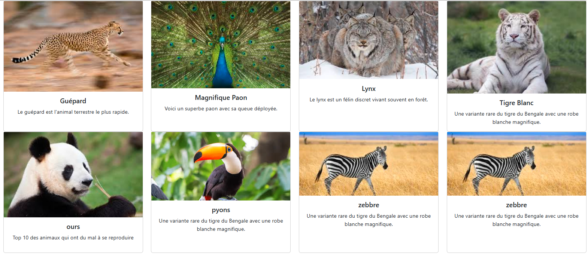
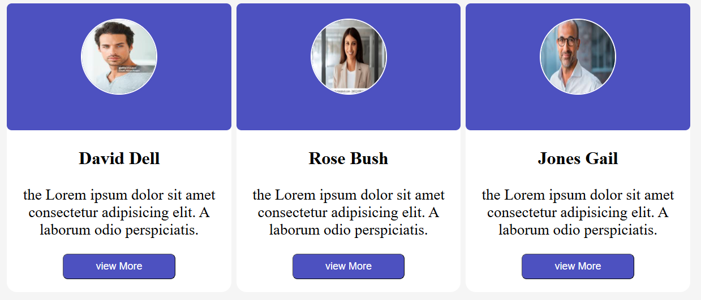

## exo html et css
description: cet dossier contient l'ensemble des exercices que j'ai eu a faire en html, css, bootstrap et talwind.
## exo 1
description: cet exercice décrit les codes que j'ai eu a faire en bootstrap.

## bootstrap: j'ai eu a utilisé les proprietés suivantes: card-body, card-title, card-text, text-center, container-fluid, row, gap, col-md, col-lg.

## exo 2
description: cet exercice decrit les codes html et css.

## css: j'ai eu a utilisé les proprieté suivantes: background-color; border-radius; margin-bottom; font-size; text-align; padding; box-sizing; display: flex; justify-content: center; align-items.

## exo 3
desciption: cet exercice rassemble les codes que j'ai a faire en html et css.

## css:  j'ai eu a utilisé les propriétés suivantes: position: absolute; top; left; text-align: center; padding: 20px; color.

## exo 4
description: cet exercice rassemble les code que j'ai a faire en talwind.

## talwind: j'ai utilisé les propriétés suivantes: min-h-screen; flex; items-center; justify-center; px-4; bg-white; p-6; rounded-lg; max-w-sm.

     
     

    
